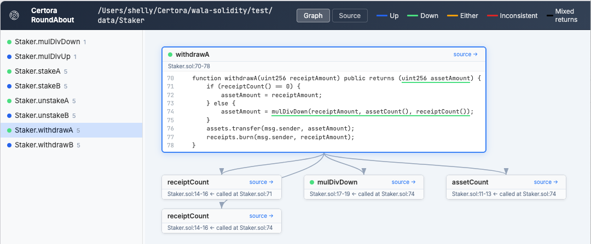

# wala-solidity

[](https://github.com/Certora/wala-solidity/actions/workflows/test-roundabout.yml) [](https://github.com/Certora/wala-solidity/actions/workflows/test-roundabout-jni.yml)

This repo is a WALA-based  Solidity analysis framework. Its first analysis, `RoundAbout`, takes a Certora `.conf` file and generates a report of the rounding behavior of variables and functions in the referenced Solidity code.

**NOTE: This project is under early beta testing and is still being actively developed. Contact us (see below) if you have feedback or questions!**


##  Dependencies
- **Java 21** _or_ **Docker** — you only need one of these. If Java is not found on your PATH, the tool automatically falls back to Docker.
- Maven (only if building from source)
- Python 3.8+
- `certoraRun`
- A Certora project with a `.conf` file
- Access to Certora tooling for the supported workflow, since `certoraRun` is used to dump ASTs

## Installation

### Option A: Docker (no Java required)

If you don't have Java installed, the tool can run via Docker. Just pull the pre-built image:

```
docker pull ghcr.io/certora/roundabout:latest
```

Then install the Python dependencies:
```
pip install .
```

`roundabout.py` will detect that Java is missing and use Docker automatically.

### Option B: Build from source (requires Java 21 + Maven)

Current builds depend on a WALA fork and on Maven artifacts published locally from that build.

1. Clone this repository, `cd` into it, and run `mvn package`.
2. Install Python dependencies:
   ```
   pip install .
   ```
   This installs the required Python packages (`json5`, `pygments`) declared in `pyproject.toml`.

##  RoundAbout Usage

### HTML Viewer (recommended)

The easiest way to use RoundAbout is through the HTML viewer, which runs the full pipeline and produces a self-contained, interactive HTML report with syntax-highlighted source and call graph visualization.

```
python3 viewer/generate_viewer.py <project-root> <input-file> <output.html>
```

- `project-root` — the directory containing the Certora project (used to resolve source file paths)
- `input-file` — a `.conf` or `.sol` file to analyze
- `output.html` — where to write the HTML report

You can run directly on a single `.sol` file without a `.conf`. Use a `.conf` file when you want to reason about multiple contracts together by specifying [`link`](https://docs.certora.com/en/latest/docs/prover/cli/options.html#link)s.



### Claude Code Skill

If you use [Claude Code](https://docs.anthropic.com/en/docs/claude-code), the `/run_roundabout` skill runs the full pipeline in one step:

```
/run_roundabout certora/conf/MyConf.conf
```

Output files (`<name>_roundabout.json` and `<name>_roundabout.html`) are placed in the current working directory.

### Low-level JGF output

If you need the raw [JGF](https://jsongraphformat.info/) JSON output (for example, for programmatic consumption), you can run the analysis directly:

1. Run `certoraRun` as you usually would given a `.conf` file, but add `--dump_asts --compilation_steps_only`. This will create `.certora_internal/latest/.asts.json`.
2. _In the same directory_, run `RoundAbout`:

   With Java:
   ```
   java -jar /path/to/roundabout-0.0.1-SNAPSHOT.jar <a .conf file> <output.json> --combined .certora_internal/latest/.asts.json
   ```

   With Docker:
   ```
   docker run --rm -v "$(pwd)":"$(pwd)" -w "$(pwd)" ghcr.io/certora/roundabout:latest <a .conf file> <output.json> --combined .certora_internal/latest/.asts.json
   ```

NOTE: You must run in the same directory, since the `absolutePath` properties in the JSON AST dump are often, in fact, relative paths starting with `.`

Unknown-type warnings are suppressed by default during normal runs. If you want to see them while debugging frontend/type translation issues, add the JVM flag `-Droundabout.warnUnknownTypes=true` before `-jar`.

### Example

We provide two tests: `test/data/Staker` and `test/data/Staker2` that can be run without needing `certoraRun` since the confs and jsons are included.

From the repository root, run:

```
java -jar target/roundabout-0.0.1-SNAPSHOT.jar test/data/Staker/run.conf staker-output.json --combined test/data/Staker/ast/.asts.json
```

and:

```
java -jar target/roundabout-0.0.1-SNAPSHOT.jar test/data/Staker2/run.conf staker2-output.json --combined test/data/Staker2/ast/.asts.json
```


## Report Format

The report format is an array of [JGF](https://jsongraphformat.info/) graphs, one for each external or public function in the Solidity files specified by the `.conf` file.  The nodes are a refinement of the underlying call graph, with a node for each call graph node and the rounding state of its arguments.  Potentially, the same function could be called with different rounding states for its arguments, so there would be multiple nodes in this JFG graph corresponding to those multiple rounding argument states.  The graph is per-public-function so that someone interested in a specific public function sees a graph specific to that function.

More specifically, the format is as follows in terms of JSON structure, following the [JGF schema](https://github.com/jsongraph/json-graph-specification/blob/master/json-graph-schema_v2.json):
```
{ "graphs": [
  'array of rounding information per external contract function as JGF graphs'
  {
    "directed": true, (required by JGF format)
    "label": string('name of public function')
    "nodes": 'dictionary indexed by node ids (numbers as strings)'
    {
      'id 0 is the entry point'
      id: {
        "label": string('name of method')
        "metadata": {
         "methodPosition": string('file name:[sl,sc-el,ec]')
         "return": string('rounding of return value')
         "parameters": 'array of info per function parameter'
	       [
	         {
	           "rounding": string('rounding of parameter')
               "position": string('position of parameter as [sl,sc-el,ec]')
               "source": string('source code of parameter declaration')
             }
           ]
          'rounding of expressions in function'
          "roundings": {
            'id is the source position of an expression, as [sl,sc-el,ec]'
            id: {
             "rounding": string('rounding of expression')
             "source": string('source code of expression')
             "expr": string('source code of surrounding expression, if any')
           }
         }
       }
      }
    }
    "edges": 'array of edges representing calls between function in nodes'
    [
      {
        "source": caller node id
        "target": callee node id
        "label": string('call site as filename:[sl,sc-el,ec]')
      }
    ]
  }
]}
```
Note that `[sl,sc-el,ec]` means a source code position as a string, written as a left square bracket, the starting line, the starting column, a hyphen, the ending line, the ending column, and a right square bracket. Filenames are interpreted relative to the `.conf` file being analyzed.


## Repository Overview

At the top level, `pom.xml` defines the Maven build, and `roundabout.py` is a helper script used during testing and debugging of the JSON-AST workflow.

- `roundAbout/`: This contains the main entrypoint plus the rounding analysis implementation
- `src/`: shared Java source for the Solidity frontend and WALA integration
- `jni/`: optional native bridge for the JNI workflow
- `test/src/`: JUnit test sources
- `test/data/`: test fixtures used by the suite
- `viewer/`: Python tooling for turning RoundAbout JSON output into an HTML viewer
- `scripts/`: helper scripts
- `libs/`: local jar dependencies referenced by `pom.xml`

## Experimental JNI / Native Path
A native JNI-based workflow is available, but it is more experimental.
This lets you compile to use the JNI code that invokes the Solidity compiler after building it from source. This path is more complex and is mainly useful for advanced users and debugging.

### Native Prerequisites
1. C++ needs to support `-std=c++23`, so it must be a reasonably recent version.
2. The `make` or `gmake` command needs to be a recent version of GNU Make. (On the Mac using [Homebrew](https://brew.sh/), `brew install make` if GNU Make is not standard)
3. (optional) cpptrace:
A utility to generate Java-like stack traces in C++. Used in `RoundAbout` development, this has greatly eased debugging. On the Mac using [Homebrew](https://brew.sh/), a simple way to get this is `brew install cpptrace`. To avoid using this, comment out `RS_FLAGS` and `RS_DEVEL_LIBS` in the Makefile.
4. Solidity:
[build the latest Solidity from source](https://docs.soliditylang.org/en/latest/installing-solidity.html#building-from-source) in some dir, hereinafter called SOLIDITY.  We need the libraries and the include files.
5. WALA:
  Clone [our fork of WALA](https://github.com/julian-certora/WALA) into some dir and checkout the `fixesToNativeBridge` branch, hereinafter called WALA.  In that directory, build using `./gradlew assemble` followed by `./gradlew publishToMavenLocal`.  If the build is too slow or dies, try `./gradlew publishToMavenLocal -xtest`. 

### Native Compilation
1. cd `WS/jni`
2. edit the Makefile: set `WALA` and `SOLIDITY` to the values chosen above.  Set `JAVA` to be the JDK home of a recent Java version.
3. if not using `cpptrace`, then comment out `RS_FLAGS` and `RS_DEVEL_LIBS`
4. run `make`

### Native Usage
1. cd into `WS/jni`
2. `java -Djava.library.path=. -jar ../target/roundabout-0.0.1-SNAPSHOT.jar <a .conf file> filename.json` where the second argument is a json file where the results will be written.

### Native / JNI Tests
JNI tests are excluded from the default `mvn test` run. To include them, first build the native library in `WS/jni`, then run the test suite with the JNI profile enabled and `java.library.path` pointed at that directory:

```
mvn -Pwith-jni-tests -DargLine="-Djava.library.path=$(pwd)/jni" test
```

## Contact

For questions about the tool, contact Julian Dolby (`julian@certora.com`) or Chandrakana Nandi (`chandra@certora.com`).
